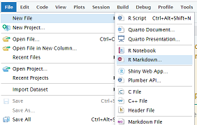
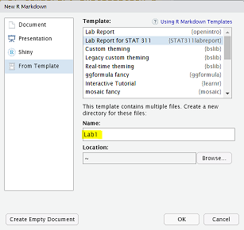
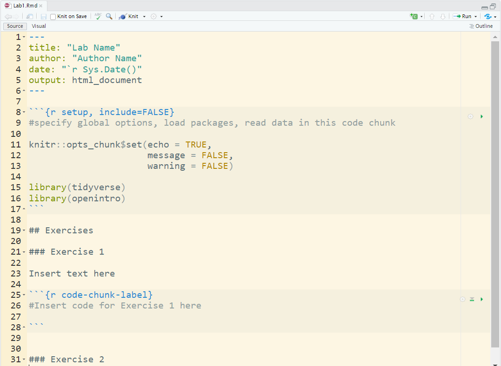
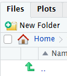
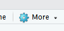

<style>

        
        /* Header colors for sections */
        h3 {
            color: orange;
            text-align: center;
        }
        
        h4 {
            color: #4B2D83;
            font-weight: bold;
            margin-left: 20px;
        }

    </style>

<div>
  
  <h3>&emsp; How do I create a new Rmd File? </h3>
  <ul>
    <li>
      From the toolbar on the top in RStudio, select File > New File > R Markdown
    </li>
    
    ```{r echo=FALSE}
        
    ```
    <li>
      In the prompt window that pops up, select From Template and then select the appropriate template. You will be prompted for the name of a new folder (directory) to save the               template in. For example, Lab1 could be a good choice for the name of your first lab and it will save in your HOME directory by default.
    </li>
     ```{r echo=FALSE}
        
     ```
      <li>
      A sample document should pop up (see image below) in the Source Editor pane on the top left.
    </li>
    ```{r echo=FALSE}
        
    ```
  </ul>
  
  <h3>&emsp; How do I create a new subfolder in RStudio? </h3>
  <h4> &emsp; &emsp; Press the "New Folder" Icon.
  ```{r echo=FALSE}
    
  ```
  </h4>
  
  <h3> &emsp; How do I copy to a directory? </h3>
  <h4> &emsp; &emsp; A directory, or subfolder, can be created using the above method.
  When copying, press the square select icon next to the file, then press the <b>More</b>
  ```{r echo=FALSE}
  
  ```
  Icon, and select <b>Copy To</b>, then navigate to the desired directory.
</div>

