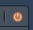

<style>

        
        /* Header colors for sections */
        h3 {
            color: orange;
            text-align: center;
        }
        
        h4 {
            color: #4B2D83;
            font-weight: bold;
            margin-left: 20px;
        }

    </style>

<div>
  <a href="https://t3rra-byt3.github.io/" style="font-weight: bold; font-size: 1.8em;">-> Homepage</a>
  <h3>&emsp; How do I create a new Rmd File? </h3>
  <ul>
    <li>
      From the toolbar on the top in RStudio, select File > New File > R Markdown
    </li>
    
    ```{r echo=FALSE}
        
    ```
    <li>
      In the prompt window that pops up, select From Template and then select the appropriate template. You will be prompted for the name of a new folder (directory) to save the               template in. For example, Lab1 could be a good choice for the name of your first lab and it will save in your HOME directory by default.
    </li>
     ```{r echo=FALSE}
        knitr::include_graphics("../Images/RmdFileCreation2.png")
     ```
      <li>
      A sample document should pop up (see image below) in the Source Editor pane on the top left.
    </li>
    ```{r echo=FALSE}
        knitr::include_graphics("../Images/RmdFileCreation3.png")
    ```
  
  <p><br><b>Note that</b></p>
  <li>
    In the parts of the document with a yellow background, you may type text as you would in a Word document. In the parts of the document with a gray background - called code chunks - you can type R code as you would type it in the Console.
  </li>
  
  </ul>
  
  <h3>&emsp; How do I create a new subfolder in RStudio? </h3>
  <ul>
    <li>
      Press the "New Folder" Icon.
  ```{r echo=FALSE}
    knitr::include_graphics("../Images/Chapter1Folder.png")
  ```
    </li>
  </ul>
  
  <h3> &emsp; How do I copy to a directory? </h3>
  <ul>
    <li>
    A directory, or subfolder, can be created using the above method.
  When copying, press the square select icon next to the file, then press the <b>More</b> 
  ```{r echo=FALSE}
  
  ```
  Icon, and select <b>Copy To</b>, then navigate to the desired directory.
    </li>
  </ul>
  
  
  
  <h3>How do I run all of my code?</h3>
  <ul>
    <li>
      Press the "Knit" Button
  ```{r echo=FALSE}
    knitr::include_graphics("../Images/KnitIcon.png")
  ```
  and wait for code to render in the Viewer Pane
    </li>
  </ul>
  
  <h3>How do I run a few lines of code at a time?</h3>
  <ul>
    <li>
      You can run a few lines at a time <b>in the Console</b> to make sure they are working by:
      <ul>
        <li>
          Placing your cursor on the specific line of code and pressing Ctrl-Enter or Cmd-Enter
        </li>
        
        <li>
          Placing your cursor on the specific line of code and pressing the “Run” button in the upper right hand corner of the R Markdown file
        </li>
        
        <li>
          By clicking on the green arrow at the top right hand corner of the code chunk
        </li>
      </ul>
    </li>
  </ul>
  
  <h3>How do I download files for submission?</h3>
  <ul>
    <li>
    First, go ahead and download a copy of each file to your computer by following the instructions below:
    </li>
    
    <ul>
      <li>
        Check the box corresponding to the file you wish to download in the Files pane. (<b>Note:</b> It is simpler to download the files one at a time to avoid dealing with compressed files.)
      </li>
      
      <li>
        Then from the drop down menu in the pane select More -> Export to download the file. Repeat for each file you wish to download.
      </li>
    </ul>
    ```{r echo=FALSE}
    
    ```
    <li>
      Upload your files (both the .Rmd and .html separately) from your computer to the CANVAS dropbox by the due date!
    </li>
  </ul>
  
  <h3>How do I end my RStudio Session?</h3>
  
  <ul>
    <li>
    To quit RStudio, type <code>q()</code> in the Console window or click on the  power button icon
    ```{r echo=FALSE}
    
    ```
    in the top right corner
    </li>
    
    <li>
      Then go back to JupyterHub and logout 
    </li>
    ```{r echo=FALSE}
    
    ```
  </ul>
  
  <h3>Common Mistakes</h3>
  <ul>
    <li>
      When an R Markdown document is knitting, it only has access to the variables that are created inside of the R Markdown document itself (it doesn't have access to variables created in the Console)
    </li>
  </ul>
  
</div>

