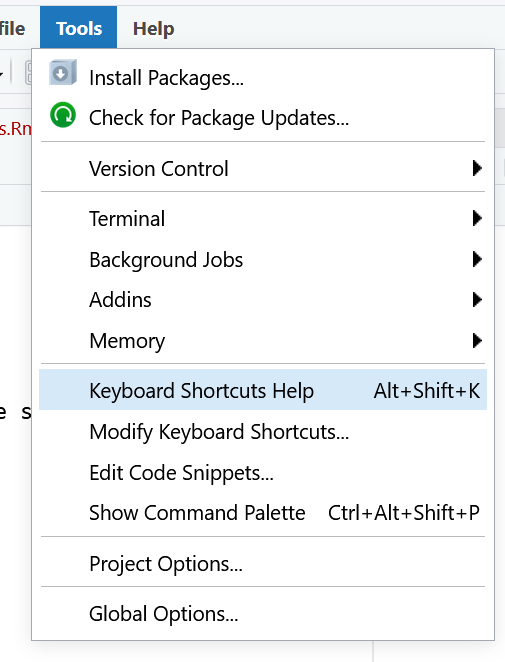

<style>
    /* Header colors for sections */
    h3 {
        color: orange;
        text-align: center;
    }
    
    h5 {
        color: #4B2D83;
        font-weight: bold;
        text-align: center;
        margin-bottom: 10px;
    }
    
    /* Center and italicize additional notes */
    .note {
        font-size: 0.9em;
        text-align: center;
        font-style: italic;
        color: #555;
        margin-top: 20px;
    }
</style>

<div>

<h3>Save Document</h3>
<p class="note">Ctrl + S (Windows) | Command + S (Mac)</p>

<h3>Run Line in Chunk</h3>
<p class="note">Ctrl + Enter (Windows) | Command + Enter (Mac)</p>

<h3>Run Entire Code Chunk</h3>
<p class="note">Ctrl + Shift + Enter (Windows) | Command + Shift + Enter (Mac)</p>

<h3>Search Help for Item (Step Into)</h3>
<p class="note">F1 key (or fn + F1 if keybinds are swapped)</p>

<h3>Quick Insert Code Chunk</h3>
<p class="note">Ctrl + Alt + I (Windows) | Command + Option + I (Mac)</p>

<h3>Knit Entire Document</h3>
<p> class="note">Ctrl + Shift + K (Windows) | Command + Shift + K (Mac)</p>

<div class="note">
    Basic shortcuts you will use most often. For more shortcuts, check 
    Tools → Keyboard Shortcuts Help 
    or press 
    Alt + Shift + K (Windows) / Option + Shift + K (Mac).
</div>

```{r echo=FALSE}

```

